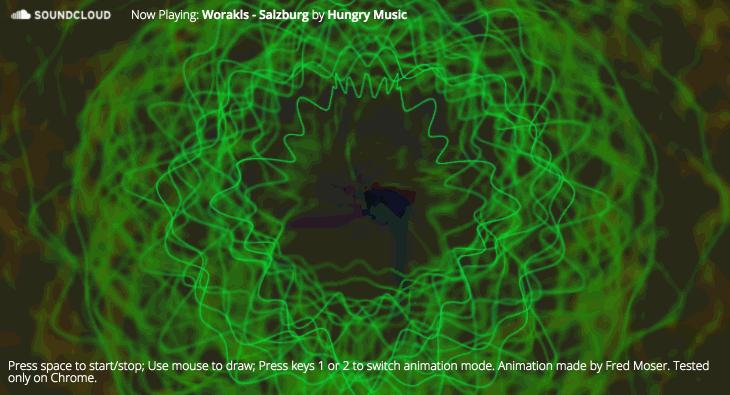

# SoundTrip

Colorful visualiser for SoundCloud



### Usage

Using artist/song code from soundcloud.com, set as parameter :

```sh
http://fxi.io/experiments/soundtrip/?artistsong=<artist/song>
```

### Sample

- ntonto/la-cle-des-champs-snippet [http://fxi.io/experiments/soundtrip/?artistsong=ntonto/la-cle-des-champs-snippet](http://fxi.io/experiments/soundtrip/?artistsong=ntonto%2Fla-cle-des-champs-snippet)
- hungry-music/worakls-elea [http://fxi.io/experiments/soundtrip/?artistsong=hungry-music/worakls-elea](http://fxi.io/experiments/soundtrip/?artistsong=hungry-music%2Fworakls-elea)
- vhoor/baiao [http://fxi.io/experiments/soundtrip/?artistsong=vhoor/baiao](http://fxi.io/experiments/soundtrip/?artistsong=vhoor%2Fbaiao)
- hungry-music/worakls-salzburg [http://fxi.io/experiments/soundtrip/?artistsong=hungry-music/worakls-salzburg](http://fxi.io/experiments/soundtrip/?artistsong=hungry-music%2Fworakls-salzburg)
- adamgyorgy/la-campanella [http://fxi.io/experiments/soundtrip/?artistsong=hungry-music/adamgyorgy/la-campanella](http://fxi.io/experiments/soundtrip/?artistsong==adamgyorgy%2Fla-campanella)


